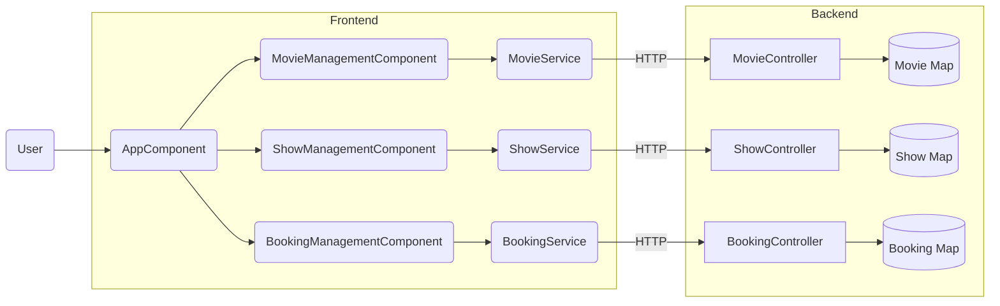

# Architecture Diagram

The diagram below shows how users interact with the Angular frontend, how the frontend components communicate with services, and how those services send HTTP requests to the Spring Boot backend.

Users interact with the UI components in the Angular client. Each component invokes a corresponding service, which makes HTTP calls to the Spring Boot controllers. The controllers manipulate in-memory maps that act as simple data stores.
